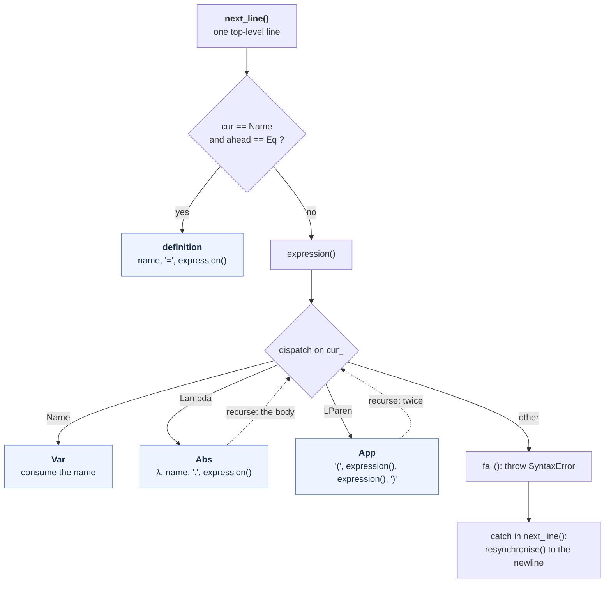

# Parser Design — recursive descent, C++ (`cpp/src/parser.{h,cpp}`)

The parser for the C++ implementation. It pulls tokens from
[the scanner](CPP_SCANNER_DESIGN.md) and returns one `Line` at a time, each
carrying an AST.

```
expression   ::= name
               | λ <name> . <body>
               | '(' <function expression> <argument expression> ')'
definition   ::= <name> = <expression>          (top level only)
```

This document covers the **implementation**. The language-level analysis —
why mandatory brackets make the left-associativity and greedy-body conventions
unnecessary, why `(λx.x)` is a syntax error, why `(λx.x y)` does not mean what
conventional notation says — is in [YACC_DESIGN.md](YACC_DESIGN.md) §1 and is
not repeated here. It applies unchanged: both implementations accept exactly
the same language.

---

## 1. Why recursive descent

Because application is explicitly bracketed, the grammar is **LL(1)**:

- every alternative of `expression` begins with a **distinct token** —
  `Name`, `Lambda`, `LParen`;
- every expression is **self-delimiting** — a name is one token, an
  application ends at its own `)`, a function ends when its single body
  expression ends.

So one token of lookahead decides everything, with no backtracking and no
precedence machinery. That is the same property that let the bison grammar run
at **0 shift/reduce conflicts** without a single `%left` (YACC_DESIGN §2) —
here it means the parser is one function per production.

This is a consequence of the *specification*, not a lucky accident. Had
application stayed conventional juxtaposition (`f x y`), the grammar would be
ambiguous, the two binding conventions would have to be resolved explicitly,
and recursive descent would need precedence climbing to get left-associativity
right. See YACC_DESIGN §8.

---

## 2. Structure



`expression()` is the whole parser: a `switch` on the lookahead token with one
case per production. The dotted edges are the only recursion, and each returns
to a slot whose end is already fixed — by the `.` having been seen, or by the
pending `)`.

```cpp
case Tok::Lambda: {
    advance();
    if (cur_.kind != Tok::Name)
        fail("syntax error: expected a name after the binder");
    std::string param = std::move(cur_.text);
    advance();
    if (cur_.kind != Tok::Dot)
        fail("syntax error: expected '.' after the bound name");
    advance();
    return mk_abs(std::move(param), expression());
}
```

The correspondence to the grammar rule is one-to-one, which is the practical
argument for recursive descent on an LL(1) grammar: the parser *is* the
grammar, with no generated table in between.

---

## 3. Lookahead: two tokens, in one place

The parser holds `cur_` and `ahead_`, refilled by `advance()`. Only one
decision needs the second token:

```cpp
if (cur_.kind == Tok::Name && ahead_.kind == Tok::Eq) { /* a definition */ }
```

A bare `Name` at the start of a line could begin either a definition or an
expression, and `=` is what separates them. Everywhere else a single token is
enough — this is the one place the grammar is LL(2), and it is cheaper to hold
a second token than to restructure the grammar to avoid it.

---

## 4. The line abstraction

```cpp
struct Line {
    enum class Kind { Term, Definition, Blank, End };
    Kind        kind;
    std::string name;    // Definition only
    TermPtr     term;    // Term and Definition
};
```

`next_line()` returns one of these, and the driver decides what it means —
print the AST, bind a name, reduce and print. **The parser performs no
evaluation and knows nothing about the environment or reduction strategies.**

This is the same separation the bison version got through an `on_term()` /
`on_define()` callback pair supplied by the driver. Returning a value is the
better shape: the parser is a source of lines rather than something that calls
back into the program, so it can be driven by a test harness without linking an
evaluator.

`Blank` covers both empty lines and lines that failed to parse — the driver
skips them identically, and the error has already been reported.

---

## 5. Errors: throw to unwind, resynchronise at the newline

```cpp
void Parser::fail(const std::string &msg)
{
    err_ << "line " << cur_.line << ": " << msg << '\n';
    errors_++;
    throw SyntaxError(msg);
}
```

An exception is the right tool here specifically because `expression()` is
**recursive**: a failure five levels deep inside nested brackets must abandon
all five frames. Returning an error code would mean every call site checking
and propagating, which is exactly the boilerplate that hides bugs. The throw is
caught in one place:

```cpp
catch (const SyntaxError &) {
    resynchronise();                 // discard through the next newline
    if (cur_.kind == Tok::Newline) advance();
    return Line{Line::Kind::Blank, "", nullptr};
}
```

The `SyntaxError` type is file-local and carries no data the handler reads —
the diagnostic was already emitted at the point of failure, where the context
is. It is a control-flow device, not an error-reporting one.

Newline is the resynchronisation point, so one bad line neither aborts the run
nor cascades into the next. Partially built subtrees are released
automatically as the exception unwinds, because every child is held by
`unique_ptr` — the bison version needed explicit `%destructor` clauses for the
same job, and a bug in one of them (an uninitialised `$$`) was the one real
memory defect found in this project.

---

## 6. Diagnostics

Because the parser is at the failure with full context, it can say what it
expected:

```
line 1: syntax error: trailing input after the expression
line 2: an application needs two expressions: (function argument)
line 3: syntax error: expected ')' to close the application
line 4: syntax error: expected an expression
line 5: syntax error: expected a name after the binder
line 6: syntax error: expected '.' after the bound name
line 7: name may not start with a digit: 1abc
```

Bison reports `syntax error` for lines 1 and 3–6. This is the clearest
practical advantage of hand-writing, and it is why the differential test
(COMPARISON.md §7) compares stderr *structurally* — same lines flagged, same
count — rather than byte for byte.

The bracket-arity message is the one both versions get right, because in the
bison grammar it is a dedicated error production rather than the generic
handler:

```cpp
if (cur_.kind == Tok::RParen)
    fail("an application needs two expressions: (function argument)");
```

It fires on `(f)`, `(x)`, `(λx.x)` — brackets are application syntax, so
exactly two expressions are required, and this is the mistake a reader
transcribing conventional λ-calculus notation makes first.

---

## 7. Parse trace

`(λx.x y)` — the case from YACC_DESIGN §1.1(b), where this grammar and
conventional notation disagree.

```mermaid
sequenceDiagram
    autonumber
    participant L as Lexer
    participant P as Parser
    participant A as AST

    Note over P: input: (λx.x y)
    P->>L: next() x2 (fill cur_, ahead_)
    L-->>P: LParen, Lambda
    Note over P: cur_ is LParen, ahead_ is not Eq<br/>⇒ an expression, not a definition

    P->>P: expression() — case LParen
    Note over P: an application: two expressions owed

    P->>P: expression() — case Lambda
    P->>L: next()
    L-->>P: Name "x"
    P->>L: next()
    L-->>P: Dot
    Note over P: binder "x"; the body is ONE expression

    P->>P: expression() — case Name
    P->>A: mk_var("x")
    A-->>P: Var
    Note over P: body complete: a name IS a whole expression.<br/>No greediness rule to consult.
    P->>A: mk_abs("x", Var)
    A-->>P: Abs
    Note over P: operand 1 done

    Note over P: cur_ is Name "y", not RParen,<br/>so the arity check passes
    P->>P: expression() — case Name
    P->>A: mk_var("y")
    A-->>P: Var

    P->>L: next()
    L-->>P: RParen
    P->>A: mk_app(Abs, Var)
    A-->>P: App
    P-->>A: Line{Term}

    Note over A: ((λx.x) y)
```

Step 8 is the one to read: the body slot took the single expression `x` and
stopped, because a `Name` *is* a complete expression. Under conventional
notation the parser would still be looking for more body here.

---

## 8. Ownership

`TermPtr` is `std::unique_ptr<Term>`, so construction is moves all the way
down:

```cpp
return mk_app(std::move(fn), std::move(arg));
```

There is nothing to free, no ownership handoff to document, and an exception
thrown mid-parse releases whatever was built so far. Names move from
`Token::text` straight into the node — no copy, no `strdup`, no `free`.

The AST types themselves are in [`cpp/src/ast.h`](../cpp/src/ast.h): a
`std::variant<Var, Abs, App>` where each alternative names its own fields, so
an `Abs` cannot be read as though it were an `App`.

---

## 9. Verified behaviour

The parser is exercised by the shared suite (`tests/`), run against both
implementations:

```
18 parse vectors        -p, AST printed fully parenthesised
12 reduction vectors    beta, normal order
10 eta vectors          -e, including both side-condition cases
19 definition vectors   shadowing, self-reference, rebinding, Church arithmetic
error recovery          7 diagnostics in one run, good lines still parsed
36 differential checks  stdout byte-identical to the bison implementation
```

`make check-cpp` runs the suite; `make compare` runs the differential test.

---

## 10. Interface

```cpp
Lexer  lexer(in, std::cerr);
Parser parser(lexer, std::cerr);

for (Line line = parser.next_line();
     line.kind != Line::Kind::End;
     line = parser.next_line()) {
    /* Term, Definition or Blank */
}
int failures = parser.errors();
```

Both streams are injected rather than hard-wired, so the parser can be driven
and its diagnostics captured without touching global state.
