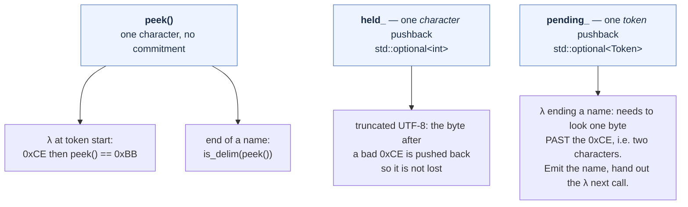
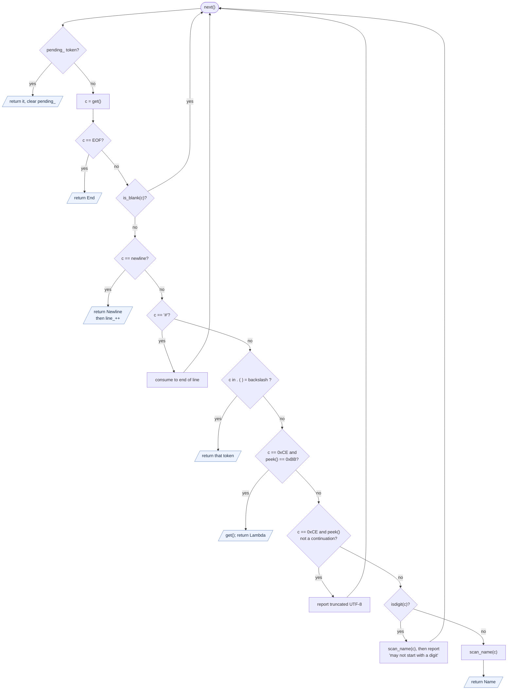

# Scanner Design — hand-written C++ (`cpp/src/lexer.{h,cpp}`)

The scanner for the C++ implementation. It reads a `std::istream` and produces
a token stream; the parser ([CPP_PARSER_DESIGN.md](CPP_PARSER_DESIGN.md))
consumes it one token at a time.

This document covers the **implementation**. The language-level analysis it
rests on — why "any sequence of non-blank characters" cannot be taken
literally, why parentheses and `=` are delimiters, why a name may end but not
start with a digit — is in [LEX_DESIGN.md](LEX_DESIGN.md) §2 and is not
repeated here. [COMPARISON.md](COMPARISON.md) covers why this exists alongside
the flex version.

---

## 1. Token set

```cpp
enum class Tok { End, Name, Lambda, Dot, LParen, RParen, Eq, Newline };

struct Token {
    Tok         kind = Tok::End;
    std::string text;       // Name only
    int         line = 1;
};
```

| Token | Produced by | Payload |
|-------|-------------|---------|
| `Name` | a maximal run of name characters | the lexeme, as a `std::string` |
| `Lambda` | `λ` (U+03BB) or `\` | — |
| `Dot` `LParen` `RParen` `Eq` | `.` `(` `)` `=` | — |
| `Newline` | `\n` | — (statement terminator) |
| `End` | end of stream | — |

Blanks and `#`-to-end-of-line comments are consumed and produce nothing.
There is no `Error` token: a bad byte is reported and skipped, and scanning
continues (§6).

`Token` owns its text. There is no `yylval`, no `strdup`, and no ownership
handoff to free later — the value is moved into the AST node when the parser
builds a `Var` or an `Abs`.

---

## 2. Character classification

Three predicates, all taking `int`:

```cpp
bool is_blank(int c);          // space \t \r \f \v
bool is_delim(int c);          // EOF, blank, \n . ( ) \ =
bool is_continuation(int c);   // 0x80-0xBF
```

`is_delim` is the negative space that defines a name: **anything not a
delimiter may appear inside one**, which is what makes `x+y`, `πr2` and `x'`
single names. Note what is deliberately *absent* from it:

- **`#` is not a delimiter.** It opens a comment only when it starts a token,
  so `x#y` is one name. This matches the flex version, where `#` is an
  ordinary name character and only the `"#".*` rule at token start makes it a
  comment.
- **`0xCE` is not a delimiter**, even though it is the first byte of `λ`.
  Handling it is §3.

---

## 3. The λ rule

`λ` is U+03BB, which in UTF-8 is the two bytes `0xCE 0xBB`. At token start the
whole rule is one comparison:

```cpp
if (c == LAMBDA_LEAD && peek() == LAMBDA_TAIL) { get(); return Tok::Lambda; }
```

Inside a name it is slightly more involved, because the binder must delimit
**mid-word** — `xλy` is three tokens, so `(xλy.y)` and `(x λy.y)` parse
identically. While accumulating a name, on meeting `0xCE` the scanner consumes
the next byte and branches:

| next byte | meaning | action |
|-----------|---------|--------|
| `0xBB` | a λ ends this name | stash `Lambda` in `pending_`, finish the name |
| a continuation byte | some other 2-byte character (`μ`, `π`, `Ω`) | append both bytes, keep going |
| anything else | truncated UTF-8 | report, `unget` it, finish the name |

`0xCE` is always a *lead* byte — continuation bytes are `0x80`–`0xBF` — so the
third case is unambiguously malformed input rather than a valid character.
That is the same fact the flex version's `[\x80-\xba\xbc-\xbf]` range encodes,
but here it is an `if` a reader can check by inspection.

---

## 4. Lookahead: three mechanisms, deliberately

The scanner needs different amounts of lookahead in different places, and uses
the cheapest thing that works for each.



Two decisions worth stating.

**`held_` rather than `istream::putback`.** `putback` is guaranteed for only a
single character and can *fail* depending on stream state. A
`std::optional<int>` owned by the `Lexer` makes `get`, `peek` and `unget`
total functions the scanner fully controls, with no dependence on what the
underlying stream supports.

**`pending_` rather than two characters of pushback.** Recognising a λ that
ends a name requires looking one byte past the `0xCE`. Rather than widen the
character buffer — which every other call site would then have to reason about
— the scanner consumes the λ, *recognises* it, and stashes the finished
`Token`. Lookahead becomes a queued result instead of an unread input, and the
buffer stays one deep. `Lexer::next()` checks `pending_` at the top of its
loop, so the path is exercised even when a diagnostic intervenes.

---

## 5. Memory layout

`Token` is 32 bytes and `Lexer` is 72, both 8-byte aligned, on LP64 targets
(x86-64 and arm64, libc++ or libstdc++). Offsets below were measured against
the real header, not derived.

```
Token (32)                          Lexer (72)
 off sz  member                      off sz  member
   0  4  kind   enum class Tok         0  8  in_       istream&  (a pointer)
   4  4  line   int                    8  8  err_      ostream&
   8 24  text   std::string           16 40  pending_  optional<Token>
                                      56  8  held_     optional<int>
 no padding, internal or tail        64  4  line_
                                      68  4  errors_
                                    no padding, internal or tail
```

### 5.1 The rules that produce those numbers

Five rules, from the Itanium C++ ABI that both AArch64 and x86-64 SysV follow:

1. **A scalar's alignment equals its size.** On LP64: `char` 1, `short` 2,
   `int` 4, pointer 8. `enum class Tok` has underlying type `int`, so 4. A
   reference member is a pointer, so 8.
2. **A struct's alignment is the largest alignment among its members.** Token
   and Lexer both contain an 8-aligned member, so both are 8-aligned.
3. **Members are laid out in declaration order.** C++ requires that members
   with the same access control be allocated with increasing addresses, so
   the compiler may *not* reorder them to save space. This is the rule that
   makes hand-reordering a real technique rather than a micro-optimisation
   the compiler already did.
4. **Each member starts at the next offset that is a multiple of its own
   alignment.** Any gap skipped to reach it is *internal* padding.
5. **The total size is rounded up to a multiple of the struct's own
   alignment.** That is *tail* padding, and it is not waste: it makes arrays
   work. Element `i` of `T[]` lives at `i * sizeof(T)`, so every element is
   correctly aligned only if the size is a multiple of the alignment.

### 5.2 Why the original Token wasted eight bytes

The first version declared `kind, text, line` — the two 4-byte fields split
by the 24-byte one. Both padding rules then fire:

```
 off sz  member                       off sz  member
   0  4  kind                           0  4  kind
   4  4  ---- padding ----  rule 4      4  4  line
   8 24  text                           8 24  text
  32  4  line                                          = 32, no padding
  36  4  ---- padding ----  rule 5
                            = 40
```

Rule 4 inserts four bytes because `text` is 8-aligned and offset 4 is not a
multiple of 8. Rule 5 then adds four more because the raw 36 must round up
to a multiple of 8. Pairing the ints costs nothing and removes both gaps.

The usable heuristic is not "largest member first" but **keep members of the
same alignment adjacent** — don't split a run of small fields with a large
one. Here `text, kind, line` would also have come to 32; `kind, line, text`
was chosen because it additionally reads in token order.

Shrinking `Token` is what shrank `Lexer`, since `Lexer` holds one inside
`pending_`. Its own member list obeys the same rules with nothing left over:
`held_` lands at 56, already a multiple of its 4-byte alignment, and the raw
72 is already a multiple of 8. No reordering of the six members removes a
byte.

### 5.3 The padding that remains, and why it stays

`Lexer` has 10 bytes of slack, all of it *inside* the two optionals, where
rule 5 applies one level down. `std::optional<T>` is laid out as the payload
followed by an engaged flag:

```
optional<Token> (40)                optional<int> (8)
   0 32  the Token                     0  4  the int
  32  1  engaged flag                  4  1  engaged flag
  33  7  ---- tail padding ----  r.5    5  3  ---- tail padding ----  r.5
```

Rule 3 does not help here: those fields belong to the standard library, not
to this header. Recovering the 10 bytes means dropping the optionals for
sentinels — `int held_ = EOF`, and `kind == Tok::End` standing for "nothing
pending". That trades a type-enforced *empty* for space this class does not
need: the driver and the REPL each construct exactly one `Lexer`, and it
allocates nothing over its lifetime (§4's `pending_` only ever holds a λ,
whose `text` is empty and stays in the string's inline buffer). `Token` is
the type worth packing, because one is copied and moved per token scanned.

---

## 6. `int`, never `char`

```
plain char '\xCE' == 0xCE ?  NO      (clang: comparison is always false)
as unsigned char:            206
```

`char` is signed on this platform, so storing `get()`'s result in a `char`
before testing makes the λ branch dead code. `std::istream::get()` returns
`int_type` precisely so `EOF` is distinguishable from a valid byte, and every
byte in this scanner stays an `int` from `get()` until the single point where
it is appended to a name:

```cpp
text += static_cast<char>(c);
```

The flex version cannot make this mistake because its byte classes never
surface a byte to C code — this is a cost of hand-writing, paid once.

---

## 7. Errors and line tracking

`error()` writes `line N: message` to the supplied `std::ostream` and bumps a
counter; the driver's exit status reflects `Lexer::errors()`. The scanner never
throws and never stops: a bad byte is reported and skipped, so one malformed
character does not hide the rest of the file.

Two diagnostics come from here rather than the parser:

```
line 3: name may not start with a digit: 1x
line 16: illegal byte: truncated UTF-8 (0xce)
```

The first consumes the whole bad name before complaining, so the message can
show it and the parser is not handed a fragment.

**Line numbering.** `line_` starts at 1 and is incremented *after* a `Newline`
token is built, so that token reports the line it terminates rather than the
one it opens. A `Name` records the line it started on. This is the same
correctness point the flex version needed a separate `tok_line` variable to
fix, because `%option yylineno` has already advanced by the time a rule's
action runs; here the counter is simply incremented in the right place.

---

## 8. The scanning loop



Every error path loops back to the top rather than returning, which is why the
`pending_` check must be inside the loop and not before it.

---

## 9. Verified token vectors

Produced by `cpp/build/lc-tokens`, which drives the real `Lexer` with no parser
in the way:

```sh
make tokens                          # builds cpp/build/lc-tokens
echo 'λx.x' | cpp/build/lc-tokens    # LAMBDA NAME(x) DOT NAME(x)
cpp/build/lc-tokens -v file.lc       # one token per line, with line numbers
```

`tests/tokens.sh` regenerates the table below and compares, so this section
cannot drift from the scanner. A blank result means the line produced only a
diagnostic.

```
x                 -> NAME(x)
x1                -> NAME(x1)
1x                -> (error: name may not start with a digit: 1x)
x+y               -> NAME(x+y)
x y z             -> NAME(x) NAME(y) NAME(z)
λx.x              -> LAMBDA NAME(x) DOT NAME(x)
\x.x              -> LAMBDA NAME(x) DOT NAME(x)
lambda            -> NAME(lambda)
μ                 -> NAME(μ)
πr2               -> NAME(πr2)
xλy               -> NAME(x) LAMBDA NAME(y)
(λf.f f)          -> LPAREN LAMBDA NAME(f) DOT NAME(f) NAME(f) RPAREN
K=λx.λy.x         -> NAME(K) EQ LAMBDA NAME(x) DOT LAMBDA NAME(y) DOT NAME(x)
x=y               -> NAME(x) EQ NAME(y)
x   # comment     -> NAME(x)
0xCE alone        -> (error: illegal byte: truncated UTF-8 (0xce))
```

`xλy`, `μ` and the lone `0xCE` are the regression cases for §3 — they are what
a naive byte-oriented scanner gets wrong.

`lambda` scanning as an ordinary name is worth noting: there are **no reserved
words**. λ is punctuation, so no keyword/identifier tie-break exists.

The scanner accepts token *sequences* the grammar rejects — `λλ`, `..`, `)(`
all scan cleanly. It validates bytes, never syntax; that is the parser's job.

---

## 10. Interface

```cpp
Lexer lexer(std::cin, std::cerr);
for (Token t = lexer.next(); t.kind != Tok::End; t = lexer.next())
    /* ... */;
int failures = lexer.errors();
```

Construction takes the input stream and the stream diagnostics go to — nothing
is hard-wired to `std::cin`/`std::cerr`. That is what makes the scanner
testable in isolation, and what `cpp/tools/dump.cpp` relies on: it is a second
`main` over the same `Lexer`, linking `lexer.cpp` and nothing else.
