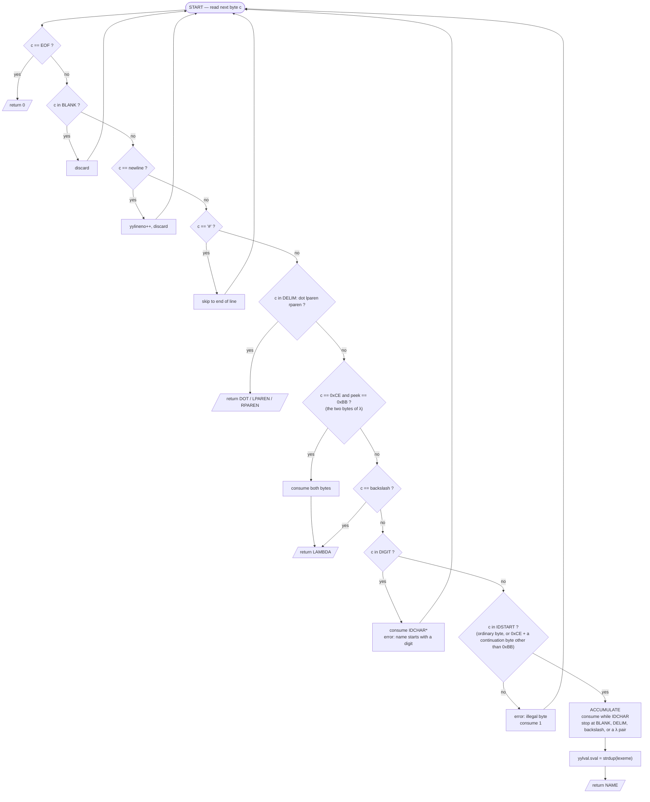
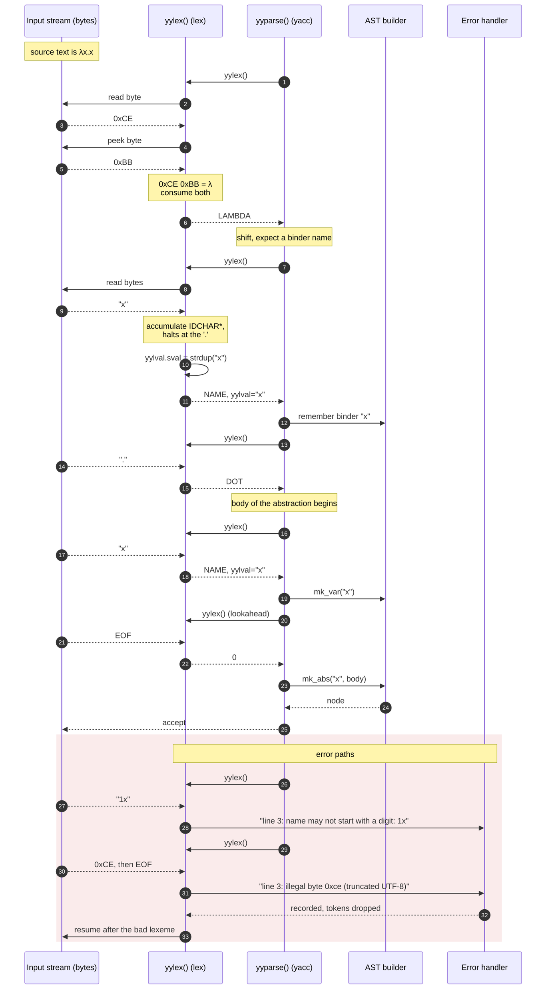

# Lexical Analyser Design — Lambda Calculus

Scanner specification for the language

```
expression  ::= name
              | function
              | application

name        ::= sequence of non-blank characters,
                may end with digits, must not start with a digit

function    ::= λ <name> . <body>
body        ::= expression

application ::= expression expression      (juxtaposition, left associative)
```

The binder is the Greek letter **λ** (U+03BB). The ASCII backslash `\` is retained
as a fallback spelling for terminals and keyboards that cannot produce λ; both map
to the same token. There is **no `lambda` keyword** — see §3.

This document defines **only** what `lex`/`flex` is responsible for: turning a byte
stream into a token stream. Grammar decisions (associativity, currying, scope of a
`.` body) belong to the `yacc` stage and are deliberately kept out of the scanner.

---

## 1. Design principles

| # | Principle | Consequence for the scanner |
|---|-----------|-----------------------------|
| P1 | The scanner is **context free** — it never asks the parser anything. | No lexer feedback hack, no symbol-table lookup during scanning. |
| P2 | **Application has no token.** | Juxtaposition is a *grammar* rule. The scanner emits `NAME NAME`; the parser reduces it to an application. Whitespace is a separator, never a token. |
| P3 | **No reserved words at all.** | λ is punctuation, not an identifier, so there is no keyword/identifier conflict to resolve. `lambda` is just a variable name. |
| P4 | **Longest match, then earliest rule** (standard lex disambiguation). | This is what makes λ dangerous: without §2.3 the scanner would prefer a long `NAME` that *swallows* the λ. |
| P5 | The scanner owns the storage of a lexeme. | `NAME` ships a heap copy through `yylval`; the parser/AST owns it afterwards. |
| P6 | Errors are tokens too. | An illegal byte becomes a diagnostic + skip, so the parser can keep going and report more than one error per run. |

---

## 2. The character universe

### 2.1 Why "non-blank" cannot be taken literally

The informal rule *"name = any sequence of non-blank characters"* breaks in two
ways under maximal munch. If `NAME` were `[^ \t\n]+`, then in

```
λx.x
```

the scanner would match `λx.x` as a **single** name: the dot, the parens and the
binder itself are all non-blank. The function body would be unreachable.

So the character universe is partitioned first, and `NAME` is defined as
*"non-blank **and** non-delimiter"*.

### 2.2 Character classes

| Class | Members | Role |
|-------|---------|------|
| `BLANK` | space, `\t`, `\r`, `\f`, `\v` | separator, discarded |
| `NEWLINE` | `\n` | separator, discarded, bumps line counter |
| `DELIM` | `.` `(` `)` | structural punctuation, each is its own token |
| `BINDER` | **λ** (U+03BB = `0xCE 0xBB`), `\` | binder introducer |
| `DIGIT` | `0`–`9` | legal inside a name, illegal as its first character |
| `EQ` | `=` | binds a top-level definition; excluded from names |
| `IDCHAR` | every other printable byte: letters, `_`, `+ - * / < > ! ? @ # $ % ^ & ~ ' " ,`, **and every non-λ multi-byte UTF-8 character** | name body |
| `BAD` | control bytes, DEL, a stray `0xCE` | error |

Parentheses are part of the grammar: an application is written
`'(' <function expression> <argument expression> ')'`, so `(` and `)` are
mandatory structural tokens rather than optional grouping. They cost one line
each in the scanner and, because they are compulsory, they remove *all*
ambiguity from the parser — see [YACC_DESIGN.md](YACC_DESIGN.md) §1.

### 2.3 The λ problem: flex matches **bytes**, not characters

This is the one non-obvious thing in the whole design.

`λ` is not a byte. In UTF-8 it is the two-byte sequence `0xCE 0xBB`. Flex has no
notion of a code point — a negated class like `[^ \t\n.()\\]` matches *any byte*
not listed, and `0xCE` and `0xBB` are not listed. So the naive spelling

```
IDCHAR   [^ \t\r\f\v\n.()\\]
NAME     {IDSTART}{IDCHAR}*
"\xce\xbb"   { return LAMBDA; }      /* WRONG — never fires */
```

is broken: on input `λx`, the `NAME` rule matches all three bytes `CE BB 78`
while the λ literal matches only two, and **longest match wins**. The result is
`NAME("λx")` and the binder silently disappears. Worse, `IDSTART` also accepts
`0xCE`, so names would be allowed to *begin* with λ.

Simply adding `\xce` and `\xbb` to the exclusion list is not the fix either: that
would also outlaw `μ`, `Ω`, `π` and every other Greek letter, since they all
share the `0xCE` lead byte.

**The fix** exploits one fact about UTF-8: `0xCE` is always a *lead* byte, never
a continuation byte (continuations are `0x80`–`0xBF`). So a name may contain
`0xCE` as long as the byte after it is not `0xBB`:

```
CEOK      \xce[\x80-\xba\xbc-\xbf]           /* any 2-byte 0xCE char except λ  */
NOTCE     [^ \t\r\f\v\n.()\\\xce]        /* name byte, not the λ lead byte */
NOTCE0    [^0-9 \t\r\f\v\n.()\\\xce]     /* same, and not a digit         */

IDSTART   {NOTCE0}|{CEOK}
IDCHAR    {NOTCE}|{CEOK}
NAME      {IDSTART}{IDCHAR}*
```

Read it as: *a name character is either an ordinary name byte, or a `0xCE` lead
byte followed by a continuation byte that isn't `0xBB`.*

The `[\x80-\xba\xbc-\xbf]` range is doing real work and must not be relaxed to a
plain `[^\xbb]`. A two-byte UTF-8 character's trailing byte is always a
continuation byte in `0x80`–`0xBF`, so pinning the range is what makes a
*truncated* λ — a `0xCE` at end of line or end of file — fail to match and fall
through to the error rule. With the loose `[^\xbb]`, `0xCE` followed by a newline
matches `IDSTART` and the scanner emits a `NAME` **containing a newline**, which
silently breaks the line counter and guarantee 3 in §8. This was caught by the
`0xCE alone` test vector in §7.

With the pinned range:

- `λ` can never start or continue a `NAME`, so the two-byte λ rule always fires.
- `μ` (`CE BC`), `π` (`CF 80`), `→` (`E2 86 92`) remain perfectly legal name characters.
- A lone or truncated `0xCE` matches nothing and falls through to the error rule.

The alternative, if this feels too clever for the codebase: define `IDSTART`/`IDCHAR`
as **positive** ASCII classes (`[A-Za-z_+\-*/<>=!?@#$%^&~']`). All UTF-8 questions
vanish, at the cost of the "any non-blank character" generality in the spec.
A third option is to build with **RE/flex** and `%option unicode`, which
understands code points natively and lets you write `[^ \t\n.()λ]` directly.

### 2.4 Digits

- `IDSTART` excludes digits → **a name never starts with a number.**
- `IDCHAR` allows digits → **a name may end with (or contain) a number.**

If the stricter reading is wanted — *digits only in a trailing run*, i.e.
`fact2` legal but `f2x` illegal — swap in `{IDSTART}{IDCHAR}*{DIGIT}*` with the
digits removed from `IDCHAR`. The permissive form is the default; it is what
every real language does and it keeps the error messages sane.

### 2.5 Worked classification

| Input | Tokens | Why |
|-------|--------|-----|
| `x` | `NAME(x)` | |
| `x1` | `NAME(x1)` | digits allowed after the first char |
| `1x` | `ERROR` | `IDSTART` rejects `1`; caught by the `{DIGIT}{IDCHAR}*` error rule |
| `x+y` | `NAME(x+y)` | `+` is an `IDCHAR`; there is no arithmetic in λ-calculus |
| `x=y` | `NAME(x) EQ NAME(y)` | `=` is *not* an `IDCHAR` — it binds a definition |
| `x y` | `NAME(x) NAME(y)` | blank separates → parser sees an application |
| `λx.x` | `LAMBDA NAME(x) DOT NAME(x)` | λ is a delimiter, so munch stops before it |
| `λλ` | `LAMBDA LAMBDA` | never one name |
| `\x.x` | `LAMBDA NAME(x) DOT NAME(x)` | ASCII fallback |
| `lambda` | `NAME(lambda)` | **not** a keyword any more — an ordinary variable |
| `μ` | `NAME(μ)` | non-λ Greek survives §2.3 |
| `λx.x y` | `LAMBDA NAME(x) DOT NAME(x) NAME(y)` | scanner is flat; parser decides the body extent |
| `(f x)` | `LPAREN NAME(f) NAME(x) RPAREN` | |
| `..` | `DOT DOT` | scanner never validates sequences |

---

## 3. Token set

| Token | Pattern | `yylval` payload | Notes |
|-------|---------|------------------|-------|
| `LAMBDA` | `"λ"` (`\xce\xbb`) \| `"\\"` | — | two spellings, one token |
| `DOT` | `"."` | — | separates binder from body |
| `LPAREN` | `"("` | — | grouping |
| `RPAREN` | `")"` | — | grouping |
| `NAME` | `{IDSTART}{IDCHAR}*` | `char *sval` (heap, `strdup`) | identifier / free or bound variable |
| `NEWLINE` *(optional)* | `\n` | — | emit only if the REPL terminates an expression at end of line |
| `0` (EOF) | `<<EOF>>` | — | yacc's end marker |
| — | `{BLANK}+` | — | discarded, no token |
| — | `#.*$` | — | comment to end of line, discarded |
| `ERROR` | `.` (anything left) | offending text | reported, then skipped |

**What dropping the `lambda` keyword buys.** With a word-spelled binder, the
scanner needs the literal rule placed *above* `{NAME}` so that a length tie is
broken in the keyword's favour, while `lambdas` must still come out as one name
via longest match. That whole tie-break disappears here: λ is punctuation, it can
never be confused with an identifier, rule order between `LAMBDA` and `{NAME}`
stops mattering, and the user regains `lambda` as a perfectly ordinary variable
name. The cost is paid instead in §2.3.

---

## 4. Scanner state machine

The scanner is a single-state DFA — there are no string literals, no nested
comments, no here-docs, so no `%x` start conditions are needed.



Three things to read out of the diagram:

1. The λ test is a **two-byte lookahead**, and it sits *above* the identifier
   path. In hand-written form that is an explicit `peek()`; in flex it is free,
   because `{IDSTART}` is constructed in §2.3 so that no `NAME` match can ever
   begin at a λ.
2. The `ACCUMULATE` loop is the only multi-byte path; it terminates on the first
   `BLANK`, `NEWLINE`, `DELIM`, backslash, or λ pair — that is what makes `λx.x`
   decomposable into four tokens.
3. There is **no keyword-comparison node** after accumulation. That node is what
   a `lambda` keyword would have cost.

---

## 5. Scanner ↔ parser interaction

`yacc` drives; `lex` is a coroutine pulled one token at a time. Nothing is
buffered ahead except yacc's single lookahead token.



Contract points:

- `yylex()` returns `int`; `0` means EOF and only EOF.
- `yylval.sval` is valid **only until the next `yylex()` call** unless it is
  `strdup`ed — so the scanner always duplicates, and the parser action takes
  ownership (frees it, or hands it to the AST node).
- Names are byte strings that may contain UTF-8. Anything downstream that reports
  a *column* or truncates a name for display must count code points, not bytes.
- `yylineno`/`yycolumn` are maintained by the scanner and read by `yyerror`.
- The scanner never calls `yyerror` for a *grammar* problem, and the parser never
  inspects `yytext`.

---

## 6. Lex source layout

```
%{
  /* C prologue: includes, y.tab.h, yylval type, helpers */
%}

%option noyywrap yylineno 8bit
%option nounput noinput

DIGIT     [0-9]
CEOK      \xce[\x80-\xba\xbc-\xbf]
NOTCE     [^ \t\r\f\v\n.()\\\xce]
NOTCE0    [^0-9 \t\r\f\v\n.()\\\xce]

IDSTART   {NOTCE0}|{CEOK}
IDCHAR    {NOTCE}|{CEOK}
NAME      {IDSTART}{IDCHAR}*
BADNAME   {DIGIT}{IDCHAR}*

%%
  /* --- discarded --- */
[ \t\r\f\v]+      { /* separator */ }
\n                { /* yylineno handled by %option */ }
"#".*             { /* comment */ }

  /* --- binder: λ, plus an ASCII fallback --- */
"\xce\xbb"        { return LAMBDA; }   /* U+03BB GREEK SMALL LETTER LAMDA */
"\\"              { return LAMBDA; }

  /* --- punctuation --- */
"."               { return DOT; }
"("               { return LPAREN; }
")"               { return RPAREN; }

  /* --- identifiers --- */
{NAME}            { yylval.sval = strdup(yytext); return NAME; }

  /* --- diagnostics --- */
{BADNAME}         { lex_error("name may not start with a digit: %s", yytext); }
.                 { lex_error("illegal byte: 0x%02x", (unsigned char)yytext[0]); }
%%
```

Ordering rationale, top to bottom: throwaways first (cheapest and most frequent),
then fixed-length literals, then the open-ended `{NAME}` rule, then the two
catch-alls. Note that the λ rule's position is now a matter of *readability*, not
correctness — §2.3 made the rules disjoint, so no length tie can arise.

### Why `%option` choices

| Option | Reason |
|--------|--------|
| `noyywrap` | single input source; avoids linking `-lfl` |
| `yylineno` | free line tracking for `yyerror` |
| `8bit` | explicit: bytes `0x80`–`0xFF` must reach the rules for UTF-8 to work |
| `nounput noinput` | silences unused-function warnings under `-Wall` |

Save the `.l` file as **UTF-8**, or write the binder rule as the escape
`"\xce\xbb"` (done above) so the source stays pure ASCII and survives any editor.

---

## 7. Test vectors for the scanner

Each line is fed alone; expected token stream follows.

```
x                  -> NAME(x) EOF
x1                 -> NAME(x1) EOF
x1y                -> NAME(x1y) EOF
1x                 -> ERROR EOF
_                  -> NAME(_) EOF
x y z              -> NAME(x) NAME(y) NAME(z) EOF
λx.x               -> LAMBDA NAME(x) DOT NAME(x) EOF
\x.x               -> LAMBDA NAME(x) DOT NAME(x) EOF
λ x . x            -> LAMBDA NAME(x) DOT NAME(x) EOF
λx.λy.x            -> LAMBDA NAME(x) DOT LAMBDA NAME(y) DOT NAME(x) EOF
λλ                 -> LAMBDA LAMBDA EOF          (lexes; parser rejects)
lambda             -> NAME(lambda) EOF           (no longer a keyword)
λx.lambda          -> LAMBDA NAME(x) DOT NAME(lambda) EOF
μ                  -> NAME(μ) EOF                (§2.3: non-λ Greek is a name)
πr2                -> NAME(πr2) EOF
xλy                -> NAME(x) LAMBDA NAME(y) EOF (λ delimits even mid-word)
(λf.f f)(λx.x)     -> LPAREN LAMBDA NAME(f) DOT NAME(f) NAME(f) RPAREN
                      LPAREN LAMBDA NAME(x) DOT NAME(x) RPAREN EOF
x   # comment      -> NAME(x) EOF
""  (empty line)   -> EOF
.                  -> DOT EOF                    (scanner accepts; parser rejects)
λμ.μ               -> LAMBDA NAME(μ) DOT NAME(μ) EOF
0xCE alone         -> ERROR EOF                  (truncated UTF-8)
```

All 20 vectors above were run against `flex 2.6` + `cc` and pass as written.
The `xλy`, `μ` and `0xCE alone` cases are the regression tests for §2.3 — they are the two that
fail under the naive spellings — the first two under `[^ \t\n]+`, the third
under a loose `[^\xbb]` trailing range. The last group states the boundary: **the scanner
never rejects a token sequence, only a byte sequence.** `.` alone, `))(`, `λλ`
are all lexically valid and syntactically wrong — that is the yacc stage's job.

---

## 8. Handoff to the parser stage

What the scanner guarantees to yacc:

1. A flat token stream drawn from `{LAMBDA, DOT, LPAREN, RPAREN, NAME, 0}`.
2. Every `NAME` carries an owned, NUL-terminated, possibly-UTF-8 string that
   contains no λ, no blank and no delimiter.
3. No token spans a newline; `yylineno` is accurate at every `return`.
4. Whitespace is gone, so the grammar rule for application is pure juxtaposition:
   `expression: expression expression` — with a precedence declaration to make it
   left-associative and to make the abstraction body extend as far right as possible.

Open questions deliberately deferred to the yacc design:

- Currying — is `λx y.M` sugar for `λx.λy.M`? If yes, it is a *grammar* rule
  (`LAMBDA namelist DOT`), not a scanner change. **Confirmed in YACC_DESIGN §8:
  implemented entirely in the grammar, zero scanner changes.**
- Top-level definitions (`id = expr`) — would need `=` promoted out of `IDCHAR`
  into its own token. **Implemented.** `=` is now excluded from `NOTCE`/`NOTCE0`
  and has its own `EQ` rule, so `K=λx.λy.x` needs no spaces. This was the one
  predicted future change that touched this file, and it was exactly one
  character in two character classes plus one rule. The cost: `=` is no longer
  legal inside a name, so `x=y` lexes as three tokens rather than one.
- Statement termination in a REPL — whether `\n` becomes a token or stays
  discarded. **Resolved in [YACC_DESIGN.md](YACC_DESIGN.md) §6: it becomes a
  token.** The parser needs a resynchronisation terminal for `error NEWLINE`
  recovery, so the rule is `\n { return NEWLINE; }`, not a discard. Blanks stay
  discarded.
