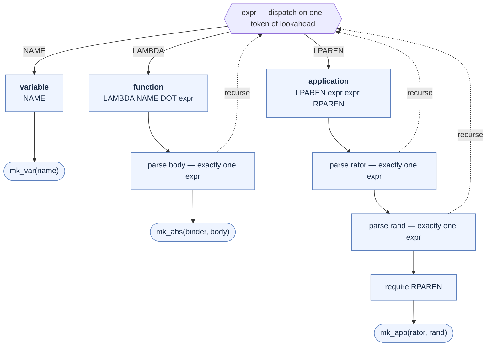
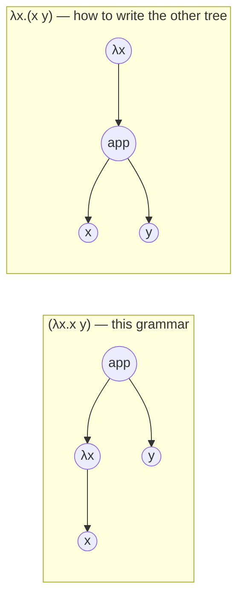

# Parser Design — Lambda Calculus (yacc / bison)

Companion to [LEX_DESIGN.md](LEX_DESIGN.md). The scanner hands up a flat token
stream drawn from `{LAMBDA, DOT, LPAREN, RPAREN, NAME, NEWLINE, 0}`; this
document turns that stream into an abstract syntax tree.

```
expression   ::= name
               | function
               | application

name         ::= sequence of non-blank characters,
                 may end with digits, must not start with a digit
function     ::= λ <name> . <body>
body         ::= expression
application  ::= '(' <function expression> <argument expression> ')'
```

**Application is explicitly parenthesised and binary.** Every application carries
its own brackets and applies exactly one argument. This one decision removes
essentially all of the difficulty from the parser — §1 explains what it buys and
what it costs.

---

## 1. What mandatory parentheses eliminate

The hard version of this grammar is the conventional one, where application is
written as bare juxtaposition (`f x`). That version needs two disambiguation
conventions that appear in every λ-calculus text:

| | Convention | Needed here? |
|---|---|---|
| **R1** | Application is **left-associative**: `f x y` ≡ `((f x) y)` | **No.** The brackets are written out, so there is no chain to associate. |
| **R2** | An abstraction body extends **as far right as possible**: `λx.x y` ≡ `λx.(x y)` | **No.** The body is exactly one `expression`, and every `expression` is self-delimiting. |

With both conventions gone the grammar is unambiguous *as written*. Concretely:

- Every alternative of `expression` starts with a **distinct token** — `NAME`,
  `LAMBDA`, `LPAREN`. The parser never has to guess which one it is in.
- An `expression` is **self-delimiting**: a `NAME` is one token; an application
  ends at its own `RPAREN`; a function ends when its single body expression ends.
- So the abstraction body needs no greediness rule. In
  `(λf.λx.(f (f x)) λy.y)`, the first operand's body is `(f (f x))` and it ends
  there — not because of a precedence rule, but because the body slot holds
  exactly one expression and that expression is complete.

The result is three productions, no `%left`, no `%right`, no `%prec`, no dummy
precedence token, and **0 shift/reduce and 0 reduce/reduce conflicts** — measured,
not assumed. The grammar is in fact LL(1) as well as LALR(1).

The cost is verbosity, paid by the person writing the terms:

```
conventional        this grammar
------------        ------------
f x y               ((f x) y)
λf.λx.f (f x)       λf.λx.(f (f x))
(λx.x x)(λx.x x)    (λx.(x x) λx.(x x))
```

### 1.1 Two consequences that will bite

These follow directly from the spec and are worth stating loudly, because both
differ from what a reader trained on conventional notation expects.

**(a) `(...)` is application syntax, not grouping.** `LPAREN` only ever appears in
the application production, so a bracket must contain **exactly two**
expressions. Therefore:

```
(λx.x)        syntax error   -- one expression in brackets
(f x y)       syntax error   -- three expressions in brackets
(x)           syntax error
()            syntax error
```

There is no way to bracket a single term for emphasis. §7 adds this back as a
one-line optional extension if you want it.

**(b) `(λx.x y)` does not mean what convention says it means.**

```
this grammar:   (λx.x y)  ->  ((λx.x) y)     application of the identity to y
convention:     (λx.x y)  ->  (λx.(x y))     abstraction whose body is (x y)
```

Both readings are verified outputs — the first from this parser, the second is
what R2 would give. The strings are identical and the trees are different. Under
this grammar the second tree must be written `λx.(x y)`. This is the single most
likely source of confusion for anyone transcribing terms out of a textbook, and
it is a *specification* consequence, not a parser bug.

---

## 2. The grammar

```
expr : NAME                       { $$ = mk_var($1);        }
     | LAMBDA NAME DOT expr       { $$ = mk_abs($2, $4);    }
     | LPAREN expr expr RPAREN    { $$ = mk_app($2, $3);    }
     ;
```

That is the entire language. Measured with `bison -d -v`: **conflicts: 0**.



The three-way branch at the top is decided by a **single token** and the
alternatives are disjoint — that is the whole reason there are no conflicts. The
dotted edges are the only recursion: each one consumes exactly one complete
expression, and each returns to a slot whose end is already determined (by `DOT`
having been seen, or by the pending `RPAREN`).

### 2.1 Full declarations

```
%union { char *sval; struct Node *node; }
%token <sval> NAME
%token LAMBDA DOT LPAREN RPAREN NEWLINE
%type  <node> expr
%start program
```

Note what is *absent*: no `%left`, no `%right`, no `%nonassoc`, no `%expect`.
A grammar that needs none of these is a grammar whose next maintainer gets a real
signal when they break it — any conflict introduced later is a genuine bug.

### 2.2 The AST

```c
typedef enum { N_VAR, N_ABS, N_APP } NodeKind;

typedef struct Node {
  NodeKind      kind;
  char         *name;   /* VAR: the variable; ABS: the bound name    */
  struct Node  *l, *r;  /* ABS: l = body;  APP: l = rator, r = rand  */
} Node;
```

The tree shape is identical to the conventional-notation version — only the
*surface syntax* changed. Everything downstream (substitution, β-reduction, a
pretty-printer) is unaffected by this document's decisions.

**Ownership of the name.** LEX_DESIGN §5 has the scanner `strdup` every `NAME`.
The parser action takes ownership: `mk_var($1)` and `mk_abs($2, …)` store the
pointer and the node's destructor frees it. On a token *discarded* during error
recovery that string leaks unless you add `%destructor { free($$); } <sval>`.
Cheap; add it.

---

## 3. Parse trace

`(λx.x y)` — the case from §1.1(b), showing the parser choose "application of the
identity" rather than "abstraction with body `x y`".

```mermaid
sequenceDiagram
    autonumber
    participant L as yylex()
    participant P as yyparse() — LALR stack
    participant A as AST builder

    Note over P: input: (λx.x y)
    P->>L: yylex()
    L-->>P: LPAREN
    Note over P: an application begins.<br/>Two expressions are now owed.

    P->>L: yylex()
    L-->>P: LAMBDA
    Note over P: operand 1 is a function

    P->>L: yylex()
    L-->>P: NAME "x"
    P->>L: yylex()
    L-->>P: DOT
    Note over P: binder = "x"; the body is ONE expr

    P->>L: yylex()
    L-->>P: NAME "x"
    P->>A: mk_var("x")
    A-->>P: VAR x
    Note over P: body complete — a NAME is one token.<br/>No greediness rule to consult.

    P->>A: mk_abs("x", VAR x)
    A-->>P: ABS
    Note over P: reduce LAMBDA NAME DOT expr → expr<br/>operand 1 done

    P->>L: yylex()
    L-->>P: NAME "y"
    P->>A: mk_var("y")
    A-->>P: VAR y
    Note over P: operand 2 done

    P->>L: yylex()
    L-->>P: RPAREN
    P->>A: mk_app(ABS, VAR y)
    A-->>P: APP
    Note over P: reduce LPAREN expr expr RPAREN → expr
    P-->>A: accept

    Note over A: ((λx.x) y)
```

Step 9 is the one to read. The body slot took the single expression `x` and
stopped — not because a precedence rule said so, but because `NAME` *is* a
complete expression. Under conventional notation the parser would still be
looking for more body here, and that difference is the entire content of §1.1(b).

Compare the two trees for the same seven tokens:



---

## 4. Error handling

```
line : expr NEWLINE     { print_node($1); }
     | NEWLINE
     | error NEWLINE    { errcount++; yyerrok; }
     ;
```

Newline is the resynchronisation point: on a syntax error the parser pops to the
`error` state, discards tokens through the next newline, and resumes. One bad
line neither aborts the session nor cascades into the next.

Measured, feeding the five malformed forms from §1.1(a) plus two good lines:

```
line 1: syntax error      -- f x      (juxtaposition is not application)
line 2: syntax error      -- (x)      (one expression in brackets)
line 3: syntax error      -- (f x y)  (three expressions in brackets)
line 4: syntax error      -- ()       (empty brackets)
(f x)
((f x) y)
exit status 1
```

Four independent diagnostics in one run, both good lines still parsed, non-zero
exit for scripting. The scanner's `yylineno` (LEX_DESIGN §5) makes the line
numbers right.

`λ.x` and `λx x` are the cases the *scanner* deliberately let through — it
validates bytes, never token sequences (LEX_DESIGN §7). They fail here, which is
where they should fail.

**Improving the message.** `syntax error` is weak for the §1.1(a) family, which
will be the most common beginner mistake. Because the arity is fixed, a targeted
rule catches it precisely:

```
expr : LPAREN expr RPAREN
       { yyerror("an application needs two expressions: (function argument)"); YYERROR; }
```

This is better than leaving it to the generic handler, because the parser knows
*exactly* what was wrong. Add the symmetric rule for three-or-more if you like.

### This settles a deferred question

LEX_DESIGN §8 left open whether `\n` should be a token. **It should**: the
`error NEWLINE` rule needs a resynchronisation terminal and a REPL needs a
statement terminator. The scanner rule becomes `\n { return NEWLINE; }` rather
than a discard. Blanks stay discarded.

---

## 5. Verified test vectors

Output is the fully-parenthesised AST. All produced by the built parser:

```
x                              ->  x
(f x)                          ->  (f x)
((f x) y)                      ->  ((f x) y)
(f (x y))                      ->  (f (x y))
λx.x                           ->  (λx.x)
λx.(x y)                       ->  (λx.(x y))
(λx.x y)                       ->  ((λx.x) y)          §1.1(b) — read it twice
λx.λy.x                        ->  (λx.(λy.x))
λx.λy.(x y)                    ->  (λx.(λy.(x y)))
(λx.x λy.y)                    ->  ((λx.x) (λy.y))
((λx.x λy.y) z)                ->  (((λx.x) (λy.y)) z)
(λf.λx.(f (f x)) λy.y)         ->  ((λf.(λx.(f (f x)))) (λy.y))   Church 2 · I
(λx.(x x) λx.(x x))            ->  ((λx.(x x)) (λx.(x x)))        Ω
lambda                         ->  lambda              an ordinary name now

f x                            ->  syntax error        no juxtaposition
(λx.x)                         ->  syntax error        §1.1(a)
(x)                            ->  syntax error
(f x y)                        ->  syntax error
()                             ->  syntax error
```

`lambda` parsing as a variable is the payoff from making λ punctuation: with no
reserved word, `lambda` is a perfectly good name.

The Ω term `(λx.(x x) λx.(x x))` is worth keeping in the suite — it is the
standard non-terminating term, so it is the test that the *evaluator* must not
hang on (§8).

---

## 6. Build

```makefile
lc: parser.tab.c lex.yy.c ast.c
	cc -o $@ parser.tab.c lex.yy.c ast.c

parser.tab.c parser.tab.h: parser.y
	bison -d -v parser.y        # -v writes parser.output — read it

lex.yy.c: lexer.l parser.tab.h
	flex -o $@ lexer.l
```

`bison -d` generates `parser.tab.h`, which the scanner includes for the token
numbers — that header is the contract between the two stages. Keep `-v`:
`parser.output` is the only place a conflict explains itself.

**Treat any conflict as a build failure.** With bison ≥ 3 add
`-Werror=conflicts-sr -Werror=conflicts-rr`. This grammar is at zero; it should
stay there.

---

## 7. Extension A — parentheses for grouping *(recommended)*

If §1.1(a) proves annoying in practice — and writing `(λx.x)` and having it
rejected does annoy people — one production restores grouping:

```
expr : ...
     | LPAREN expr RPAREN        { $$ = $2; }   /* grouping: builds no node */
     ;
```

Measured: still **0 conflicts**. One token of lookahead after `LPAREN expr`
decides it — `RPAREN` means grouping, anything else means a second operand
follows. Verified:

```
(λx.x)                          ->  (λx.x)         now legal
((λf.λx.(f (f x))) λy.y)        ->  ((λf.(λx.(f (f x)))) (λy.y))
(f x)                           ->  (f x)          unchanged
```

The action builds **no node** — grouping steers the parse and leaves no trace in
the tree, so a pretty-printer re-derives brackets from structure alone. This is a
strict superset of the specified language: every previously valid term still
parses to the same tree. Recommended unless the redundancy is deliberate.

## 8. Extension B — juxtaposition

The conventional surface syntax (`f x y`, no brackets) is the ergonomic upgrade
path, and it is where R1 and R2 come back. It is *not* a small change: the naive
version is genuinely ambiguous, and a first stratification attempt still measures
**3 shift/reduce conflicts**, all in one state:

```
state 10
    6 expr: app .
    8 app: app . atom
    NAME  shift, and go to state 4
    NAME  [reduce using rule 6 (expr)]
```

The parser holds a complete application and sees another `NAME`: **shift** to
extend it (R1) or **reduce** to end it? The conflict-free formulation puts a
trailing abstraction one level up, so nothing can follow it:

```
expr : app | app abs | abs ;
abs  : LAMBDA NAME DOT expr ;      /* body is expr ⇒ greedy (R2)      */
app  : app atom | atom ;           /* left recursion ⇒ left-assoc (R1) */
atom : NAME | LPAREN expr RPAREN ;
```

Measured at **0 conflicts**, with `f g λx.x y` → `((f g) (λx.(x y)))`. The
mechanism: `FOLLOW(expr)` shrinks to `{RPAREN, NEWLINE, $end}`, so in state 10
the reduce is no longer a legal action and the shift is unopposed.

Adopting this is a **breaking change** — §1.1(b) says `(λx.x y)` re-parses from
`((λx.x) y)` to `(λx.(x y))`. Existing terms would have to be re-read, not just
re-parsed. Do it deliberately or not at all.

## 9. Extension C — currying

`λx y z.M` as sugar for `λx.λy.λz.M` is a grammar change with no scanner impact,
exactly as predicted in LEX_DESIGN §8:

```
expr  : ... | LAMBDA names DOT expr  { $$ = curry($2, $4); } ;
names : NAME { $$ = nl_new($1); } | names NAME { $$ = nl_add($1, $2); } ;
```

`curry()` folds the list right-to-left so the last name binds innermost.
Measured at **0 conflicts**, with `λx y z.(x z (y z))`-style terms nesting
correctly. The list is left-recursive for the usual yacc reason (bounded stack)
while the fold supplies the right-nesting the semantics need — grammar direction
and AST direction are allowed to differ.

---

## 10. What comes after parsing

The parser's job ends at a well-formed tree. Items 1–3 below are implemented in
`src/eval.c`, and the definitions half of item 4 in `src/env.c`.

1. **Free/bound variable analysis** — a walk computing `FV(e)`.
2. **Capture-avoiding substitution** `e[x := v]` — the one genuinely subtle
   algorithm here; needs α-conversion when a substitution would capture a free
   variable.
3. **β-reduction** `(λx.M N) → M[x := N]`, plus a strategy: normal order
   (leftmost-outermost — terminates whenever any strategy does) vs. applicative
   order (arguments first, but diverges on some terms that have normal forms).
4. **A REPL** — `let` bindings for named terms, and a step limit so the Ω term
   from §5 does not hang the process. **Both implemented**: `line: NAME EQ expr
   NEWLINE` adds top-level definitions (still 0 conflicts — one token of
   lookahead after `NAME` separates a definition from a bare expression), and
   `-s` bounds reduction. An *interactive* REPL, with a prompt and readline, is
   not.

Item 2 is where the real difficulty of an evaluator lives, and it played out as
predicted: `substitute()` alpha-renames a binder whenever the value being
substituted has a free occurrence of it, so `(λx.λy.(x y) y)` reduces to
`(λy1.(y y1))` rather than the captured `(λy.(y y))`. None of 1–4 required any
change to the scanner or the grammar.
